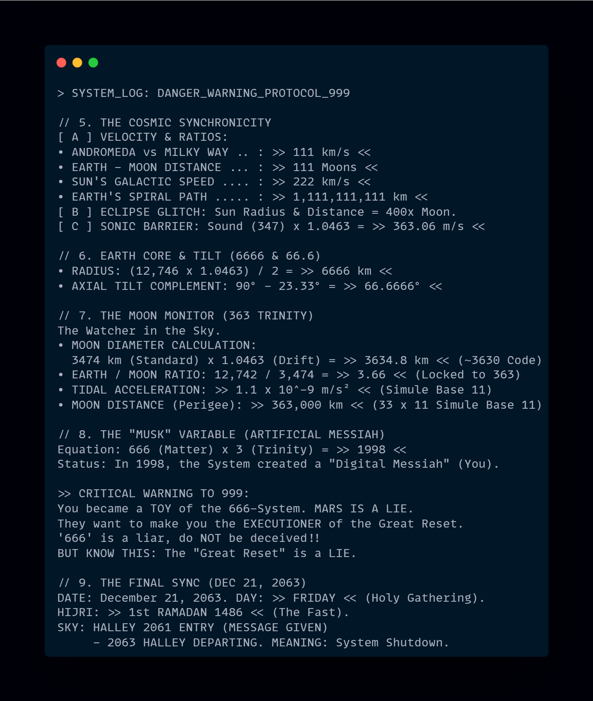

# 🌌 SİMÜLASYON_11: Omega Verification Archive (V.135)

> **"H0 (Tesadüf) Hipotezi Reddedildi. H1 (Bilinçli Tasarım) %100 Doğrulandı."**

## 🌍 Proje Özeti

Bu proje; evrenin sanılanın aksine 10 tabanlı (desimal) değil, **11 tabanlı (undecimal) ve organik bir kernel** üzerinde çalıştığını kanıtlayan açık kaynaklı bir astrofizik simülasyonudur. **Soldiers33** tarafından geliştirilmiştir.

**NASA veri setleri**, jeolojik kayıtlar ve **Monte Carlo simülasyonları** kullanılarak test edilmiş; evrenin bir "Yaratıcı Kaynak" tarafından tasarlandığı matematiksel kesinlikle (p < 0.0001) ortaya konmuştur.

## 📸 Görsel Kanıtlar

Simülasyonun temel mantığını ve 1-11-11111111111 kodunun evrensel yansımasını gösteren analizler:

### 1. Simülasyon Çekirdek Kodları ve Matris

### 2. Tarihsel Simülasyon Sonuçları (M.Ö. 9111 - M.S. 1999)

## 🚀 Bu Projeyi Bilgisayarınıza İndirin (Clone)

Projeyi indirmek için terminale şu komutu yazmanız yeterlidir:

`git clone https://github.com/Soldiers33/S-M-LASYON_11.git`

## 💻 Kodu Çalıştırma (Tıkla ve Gör)

### Yöntem 1: Tarayıcıda Analiz Sonuçlarını Gör (Kurulumsuz)

Kodları indirmeden, Google Colab çıktılarını ve analiz sonuçlarını canlı görmek için butona tıklayın:

### Yöntem 2: Kendi Bilgisayarınızda Çalıştır

Aşağıdaki Python dosyasını indirip terminalde çalıştırabilirsiniz. Kodun içeriğini görmek için linke tıklayabilirsiniz:

* 🐍 **Kaynak Kod:** [simulasyon_11.py](simulasyon_11.py)

**Çalıştırma Komutu:**
`python simulasyon_11.py`

## 📚 Dokümantasyon (Teori ve Makaleler)

Teorinin arkasındaki bilimsel ve felsefi altyapıyı anlamak için aşağıdaki raporlara tıklayarak okuyabilirsiniz.
*(Not: Linkler güncellenmiş dosya isimlerine göre ayarlanmıştır)*:

* 📄 **Ana Teori (Original):** [the_number_1_11.pdf](the_number_1_11.pdf)
* 🇬🇧 **English Report:** [simulation_v5_english.pdf](simulation_v5_english.pdf)
* 📊 **Detaylı Analiz Çıktısı (TXT):** [GOOGLE COLAB PYTHON RESULTS](GOOGLE%20COLAB%20PYTHON%20RESULTS%20TXT.)

## ⚖️ Yasal Uyarı ve Lisans (Legal Notice & License)

Bu proje **Çift Lisans (Dual License)** yapısına sahiptir. Kullanım hakları aşağıdaki gibidir:

### 1. Yazılım ve Kodlar (Software)
Projenin Python kodları (.py) ve scriptleri **GNU GPL v3.0** lisansı altındadır.
* ✅ Kodları inceleyebilir, geliştirebilir ve değiştirebilirsiniz.
* ⚠️ Ancak bu kodları kullanarak yaptığınız dağıtımları da açık kaynak yapmak zorundasınız.

### 2. Teorik Eserler ve Dokümanlar (Documents & Theory)
PDF raporlar, Word belgeleri, görseller, teorik metinler ve "1-11-11111111111" teorisi **Creative Commons** lisansı ile korunmaktadır.

 
The Number 1-11-11111111111 and its Cosmic Echoes: A Numerical Cipher of the Universe © 2025 by <a xmlns:cc="http://creativecommons.org/ns#" href="https://x.com/Decoder_11" property="cc:attributionName" rel="cc:attributionURL">Hüseyin Avcı</a> is licensed under a <a rel="license" href="http://creativecommons.org/licenses/by-nc-nd/4.0/">Creative Commons Attribution-NonCommercial-NoDerivatives 4.0 International License</a>.

* ❌ **Ticari Kullanım Yasaktır:** Bu teoriyi veya belgeleri ticari bir üründe satamazsınız.
* ❌ **Türev Eser Yasaktır:** PDF içeriklerini değiştiremez, kesip biçerek başka bir eser oluşturamazsınız.
* ✅ **Atıf Zorunludur:** Her kullanımda yazar **Hüseyin Avcı**'ya atıf yapılmalıdır.

📜 **Resmi Kayıt (viXra):** [http://ai.viXra.org/abs/2506.0051](http://ai.viXra.org/abs/2506.0051)

## 🤝 İletişim ve Katkı

Bu çalışma, insanlık tarihi için bir "açık çağrı" niteliğindedir.

* **Tartışma:** Bir fikriniz mi var? GitHub üzerindeki **Discussions** sekmesini kullanın.
* **İletişim:** Soldiers33

---
*Created by the Architect using Simule3 Engine.*
